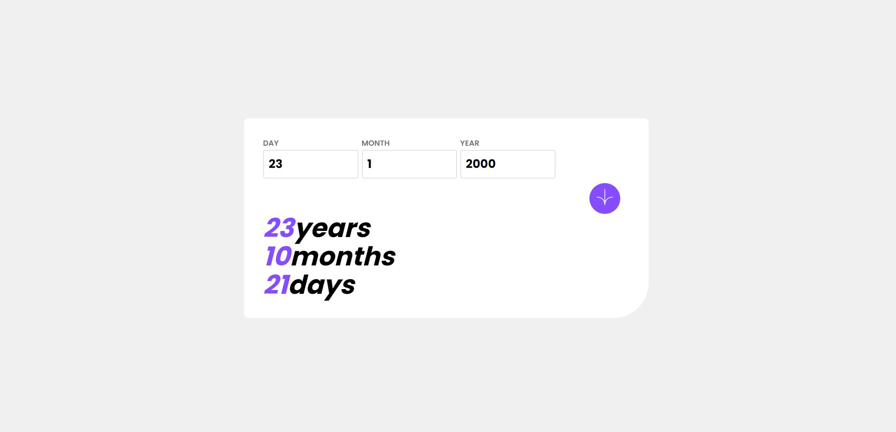
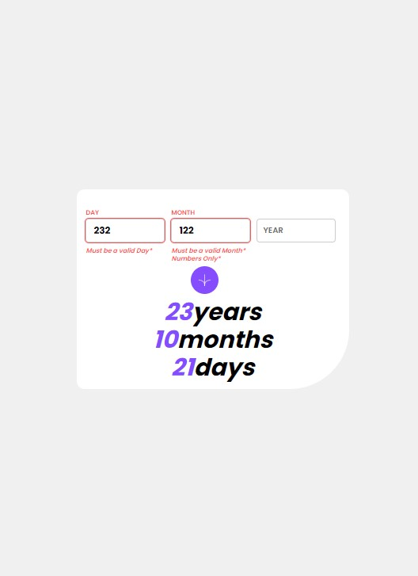

# Age Calculator (V2.0)

## Table of contents

- [Overview](#overview)
  - [The challenge](#the-challenge)
  - [Screenshot](#screenshot)
  - [Links](#links)
- [My process](#my-process)
  - [Built with](#built-with)

## Overview

### The challenge

Users of this site can:

- View an age in years, months, and days after submitting a valid date through the form
- Receive validation errors if:
  - Any field is empty when the form is submitted
  - The day number is not between 1-31
  - The month number is not between 1-12
  - The year is in the future
  - The date is invalid e.g. 31/04/1991 (there are 30 days in April) (V2.0)
- See the age numbers animate to their final number when the form is submitted (V2.0)
- View the optimal layout for the interface depending on their device's screen size (Full Responsiveness)
- See hover and focus states for all interactive elements on the page

### Screenshot

## Desktop version :

## Mobile version :

### Links

- Live Site URL: (https://moienheydari.github.io/age-calculator/index.html)

## My process

### Built with

- [React](https://reactjs.org/) - JS library
- single data file structure
- Semantic HTML5 markup
- SASS
- CSS custom properties
- CSS Flexbox
- external svg & component usage
